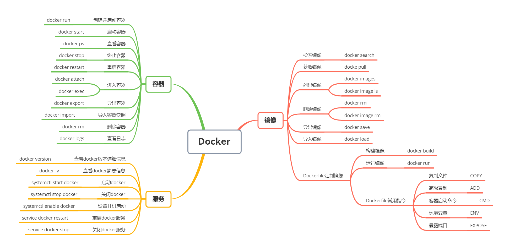

#### docker常用命令



#### 创建mysql镜像
```
docker run -it -d --name emos-mysql -p 3307:3307 \
-m 500m -v /Users/wgy/ALL/config/dockerData/emos-mysql/mysql:/var/lib/mysql \
-v /Users/wgy/ALL/config/dockerData/emos-mysql/config:/etc/mysql/conf.d  \
-e MYSQL_ROOT_PASSWORD=2340666 \
-e TZ=Asia/Shanghai mysql:8.0.23 \
--lower_case_table_names=1
```
